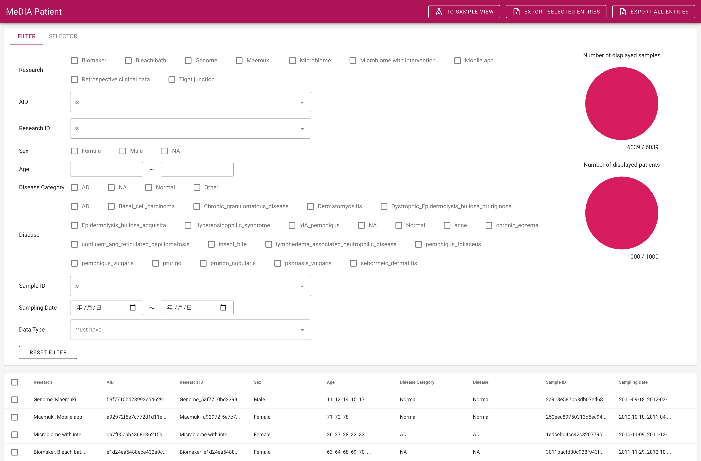

# MeDIA: Medical Data Integration Assistant

A system to support the integration and management of multimodal medical data.



The MeDIA system has two components:

- MeDIA App
  - A web application that provides the user interface to browse and extract the integrated data
- Elasticsearch
  - A data store that provides search API, running behind the MeDIA app

## Prerequisites

- [Docker](https://www.docker.com)
- [docker-compose](https://docs.docker.com/compose/)

### Kernel option

Change Kernel options if necessary for Elasticsearch and Nuxt.js as follows:

```bash
# For Elasticsearch
$ sysctl -w vm.max_map_count=262144

# For Nuxt.js
$ sysctl -w fs.inotify.max_user_watches=524288

# Reload sysctl
$ sysctl -p
```

### RAM size for Elasticsearch

[`docker-compose.yml`](./docker-compose.yml) assigns 16GB heap memory to the Elasticsearch container. The system will fail to launch if your computer does not allow Docker to use enough amount of RAM. Change the volume e.g. `-Xms4g -Xmx4g` to change the assigned RAM volume, but may fail to load a large size data.

## Launch the system

If the data is loaded

```bash
$ git clone git@github.com:MeDIA-team/MeDIA.git
$ cd MeDIA
$ mkdir -p -m 777 Elasticsearch/data # Create data directory
$ docker network create media_network
$ docker-compose up -d --build
```

## Documents (in Japanese)

- User guide: [ui-docs.md](./ui-docs.md)
- For admin:
  - [MeDIA App](./app/README.md)
  - [Elasticsearch](./Elasticsearch/README.md)
