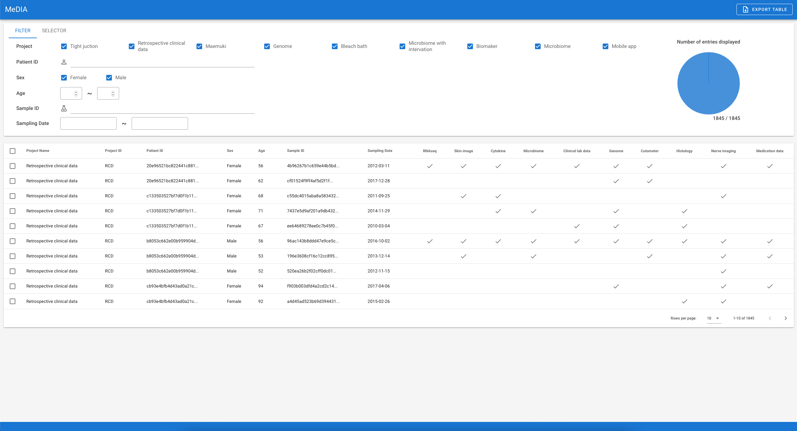
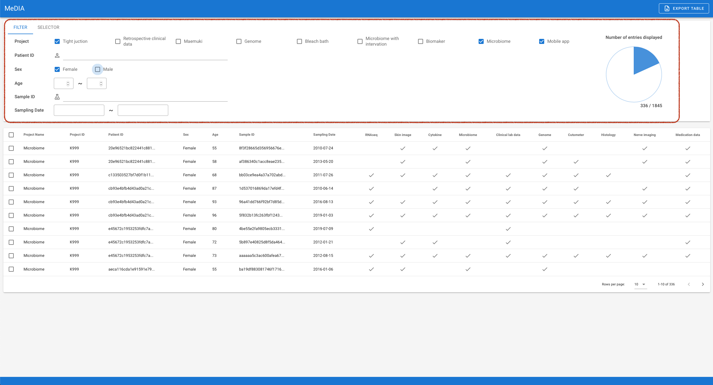
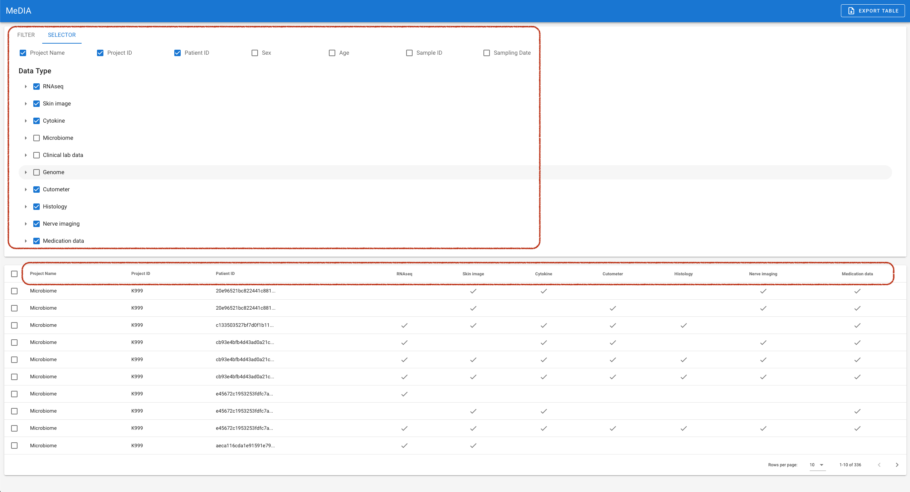
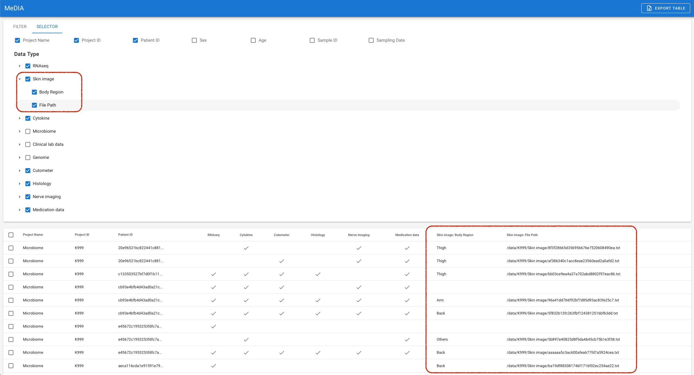
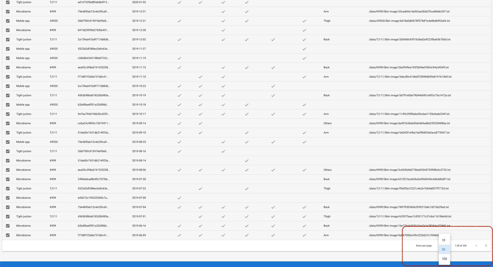
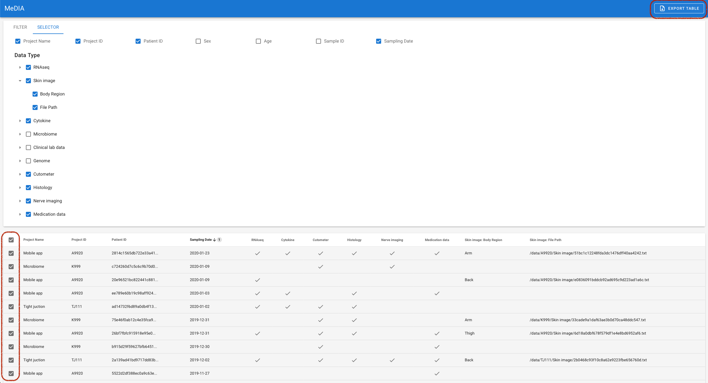

# MeDIA Web

- データの閲覧/出力を行う Web アプリケーション

## 使い方

起動直後は以下の画面である。



まず、Filter Tool を使うことによって、行を制限できる。



次に、Selector Tool を使うことによって、表示する列を制限できる。



また、Selector Tool のプルダウンメニューを開くことによって、より詳細な情報の列を表示できる。



Sort 機能として、それぞれの列の Header をクリックすることで Sort を行える。


Pagination や表示できる行数を替えながら、Export したい行を選択する。



最後に、Export Table ボタンを押すことで、選択した行が、select された列のまま (つまり現在見えている table の列) が tsv file として出力される。



## 設定

設定項目は、`../docker-compose.yml` の environment に集約されている。

```yaml
environment:
  BASIC_AUTH_PASS: "ascade"
  BASIC_AUTH_USER: "media"
  BASIC_ENABLED: "true"
  BROWSER_BASE_URL: "http://ext-host0004.ascade.co.jp:8888"
  ES_URL: "http://db:9200"
  NUXT_HOST: "0.0.0.0"
  NUXT_PORT: "8080"
```

- `BASIC_AUTH_PASS`
  - Basic 認証の password
- `BASIC_AUTH_USER`
  - Basic 認証の user name
- `BASIC_ENABLED`
  - Basic 認証をかけるかどうか (true or false)
- `BROWSER_BASE_URL`
  - クライアントから見た際の、MeDIA Web の URL
  - 基本的に nginx へと入るための URL を記述すればよい
- `ES_URL`
  - Elasticsearch の URL
  - docker network で設定されているため、基本的に変更する必要がない
- `NUXT_HOST`
  - MeDIA Web を起動する Host
  - docker network で設定されているため、基本的に変更する必要がない
- `NUXT_PORT`
  - MeDIA Web を起動する Port
  - docker network で設定されているため、基本的に変更する必要がない

## JSON データの読み込み

Data Crawler を用いて、作成した JSON Data を Elasticsearch に読み込むためのコマンドとして、 `npm run bulk` が用意されている。Elasticsearch に Index が存在しない場合、このコマンドを使うことで自動的に生成される。

```bash
# (注意) -- が必要である、絶対 path が望ましい
$ npm run bulk -- /your/json/file/path
```

このコマンドを使用するために、Host Machine の `./data` Directory が Docker Container 内に Mount されている。そのため、実際には、

```bash
$ ls data
your.json

$ docker-compose exec app npm run bulk -- /opt/MeDIA_Web/data/your.json
```

で bulk 処理が行える。ここで注意することとして、 `/opt/MeDIA_Web` に Host Machine の Web Dir が mount されていることである。

---

Dummy Data として、`./tests/dummy-data.json` が用意してある。そのため、Dummy Data を使って読み込む場合は、

```bash
$ docker-compose exec app npm run bulk -- /opt/MeDIA_Web/tests/dummy-data.json
```

を実行する。

また、Dummy Data は `./tests/generate-dummy-data.js` を使って生成している。実行したい場合は、

```bash
$ npx node ./tests/generate-dummy-data.js
```

を実行する。

## Development mode

Development mode での起動は、まず `../docker-compose.yml` の command を編集する。

```
-    command: ["npm", "run", "start"]
-    # command: ["tail", "-f", "/dev/null"]
+    # command: ["npm", "run", "start"]
+    command: ["tail", "-f", "/dev/null"]
```

その後、production mode と同様に `docker-compose up` をし、手動で nuxt dev server を起動する。

```bash
$ docker-compose up -d
$ docker-compose exec app npm run dev
```

ネットワーク周りの設定は、production mode と同様である。
