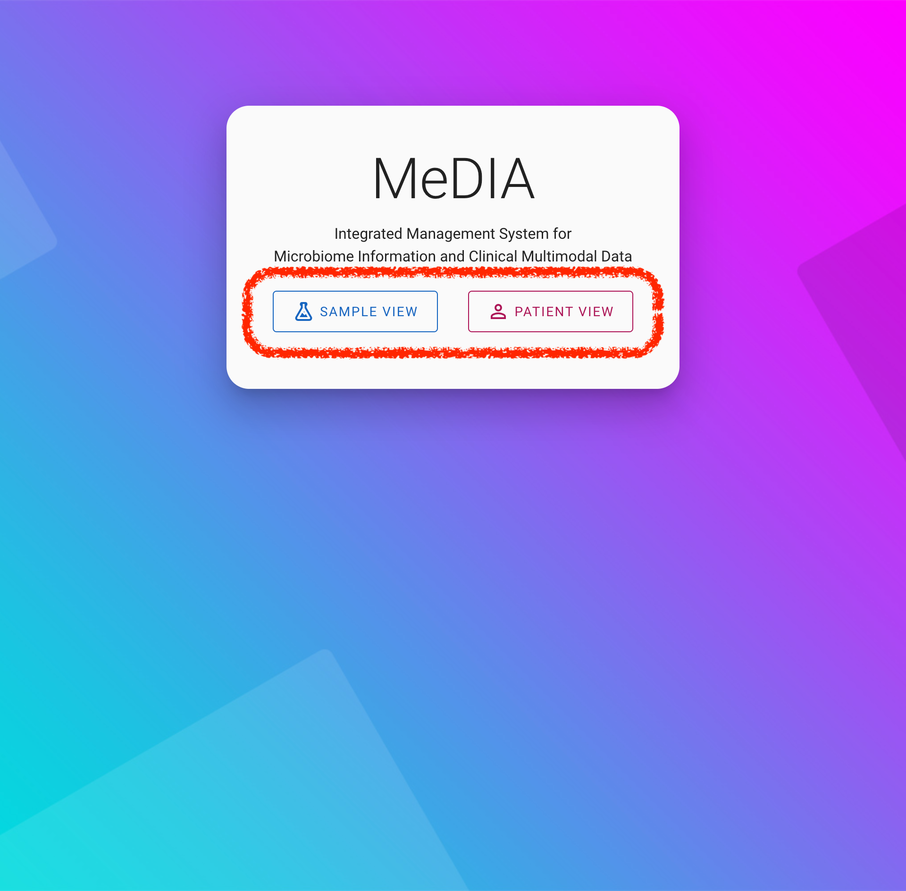
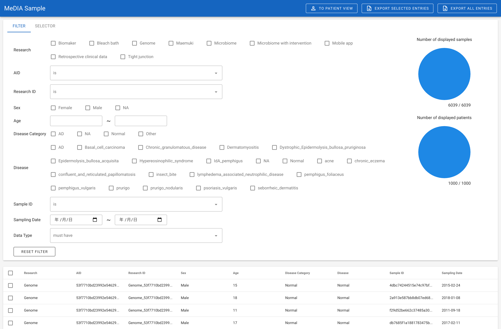
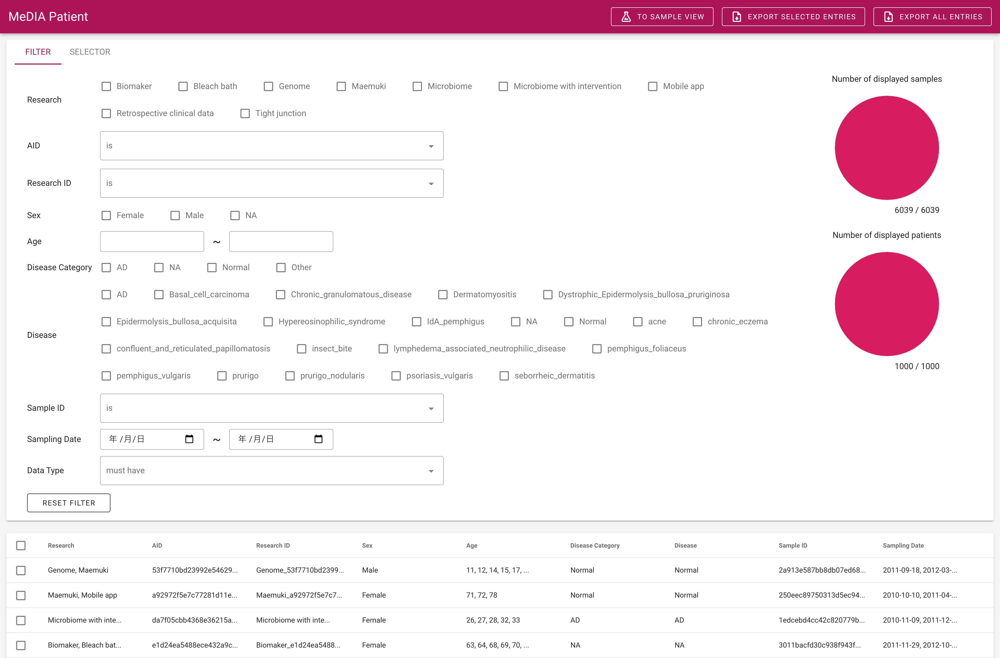
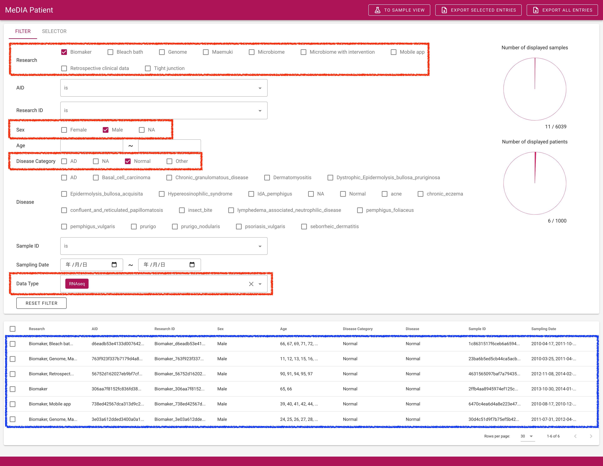
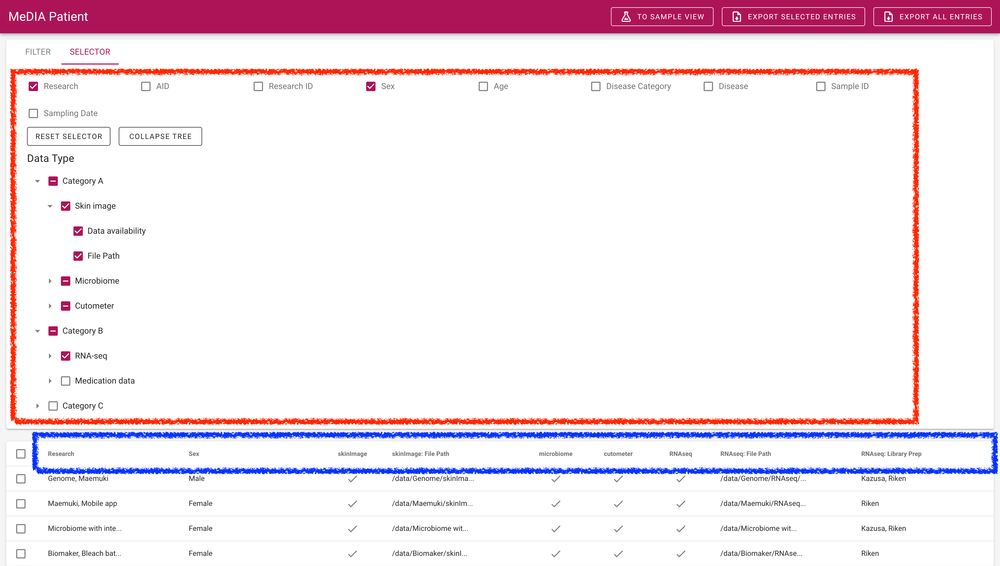
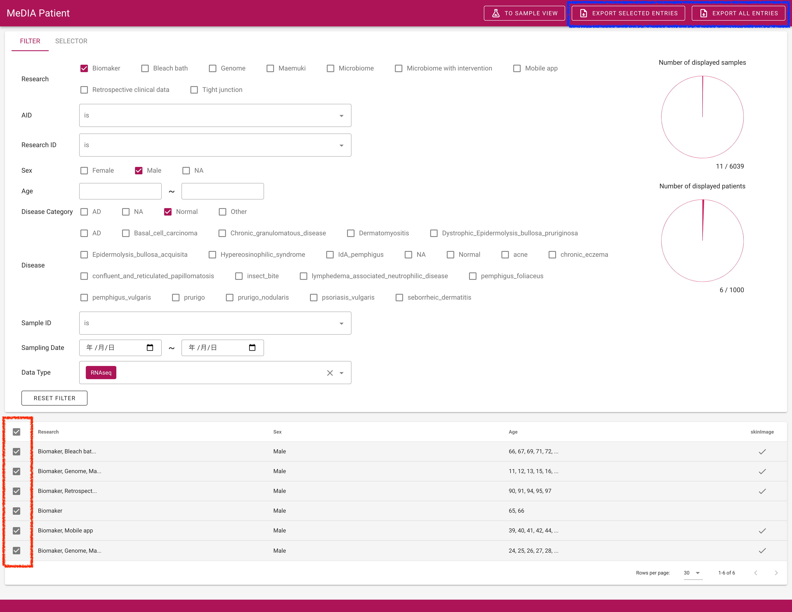
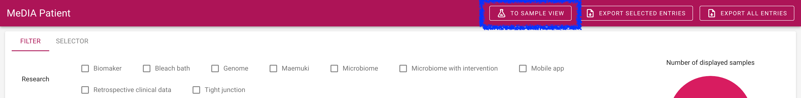
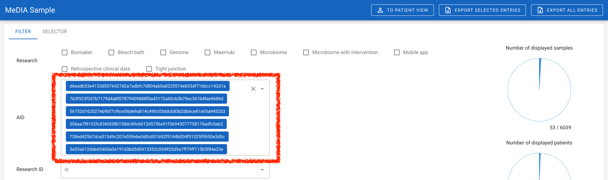
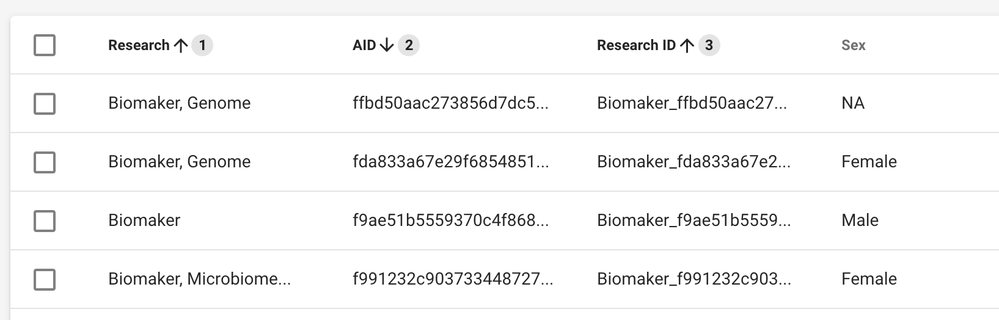

# MeDIA 利用者向けドキュメント

MeDIA 起動時、下記の画面が表示される。



図赤枠内の `SAMPLE VIEW` と `PATIENT VIEW` ボタンを用いてそれぞれのシステムへと遷移する。

- `Sample View`: Table の行単位が Sample
- `Patient View`: Table の行単位が Patient

MeDIA における data の最小単位は、カルテや塩基配列といったデータに紐づくメタデータ群である。
メタデータとして、

```json
{
  "sampleId": "sampleIdExample",
  "patientId": "patientIdExample",
  "research": "researchExample",
  "dataType": "RNA-seq",
  "samplingDate": "xxxx/xx/xx",
  "disease": "diseaseExample",
  ...
}
```

のようなものが考えられるが、このメタデータにおける `sampleId` と `patientId` を unique な key としてメタデータを集計し、それぞれの view を構成している。

**Sample View**



**Patient View**



## Filter 機能

filter toolbox において、filter 条件を指定する (図赤枠) ことで、table に表示されるデータ (図青枠) を絞り込むことができる。
filter 条件のそれぞれは、AND 条件として絞り込みを行う。



## Selector 機能

selector toolbox において、table の header として用いる項目を指定する (図赤枠)。
チェックされた項目から table の header が生成されている (図青枠)。
Data availability はそのデータが存在しているかどうかを✔で表示する。



## データ出力機能

表示されている table を出力する機能がある。
図青枠の、`EXPORT SELECTED ENTRIES` と `EXPORT ALL ENTRIES` ボタンを用いて tsv file を download します。

- `EXPORT SELECTED ENTRIES`: 図赤枠のチェックボックスにおいて、チェックした項目を出力する。
- `EXPORT ALL ENTRIES`: チェックした項目に関わらず出力する。1000 件といった pagination が発生する巨大な table を出力するために用いる。



filter toolbox, selector toolbox のそれぞれの条件によって絞り込まれた結果を出力される。
そのため、出力されたデータの例としては下記が上げられる。
1 行目は header 行であり、2 行目からデータが出力される。
項目間は tab である。
また、1 つの項目の中に複数のデータがある場合は、それぞれのデータを `, ` で結合されている。

```
research                                sex     age                               skinImage
Biomaker, Bleach bath, Mobile app       Male    66, 67, 69, 71, 72, 73, 74, 76    true
Biomaker, Genome, Maemuki               Male    11, 12, 13, 15, 16, 17, 19, 20    true
Biomaker, Retrospective clinical data   Male    90, 91, 94, 95, 97                true
Biomaker                                Male    65, 66                            false
Biomaker, Mobile app                    Male    39, 40, 41, 42, 44, 45            true
Biomaker, Genome, Maemuki               Male    24, 25, 26, 27, 28, 30, 31        true
```

## その他の機能

### 他の view に移動

view 右上の `TO SAMPLE VIEW` ボタン (図青枠) を用いて、他の view に遷移できる。
この際、元いた view で行を選択していた場合、遷移後の view で filter 条件 (`sampleId` や `patientId`) が初めから設定されている (図赤枠) 。





### sort 機能

table header のそれぞれの項目をクリックすることで、table の sort を行える。



### Copy to click 機能

table におけるそれぞれの data 項目をクリックすることで、clipboard に data 項目をコピーできる。
